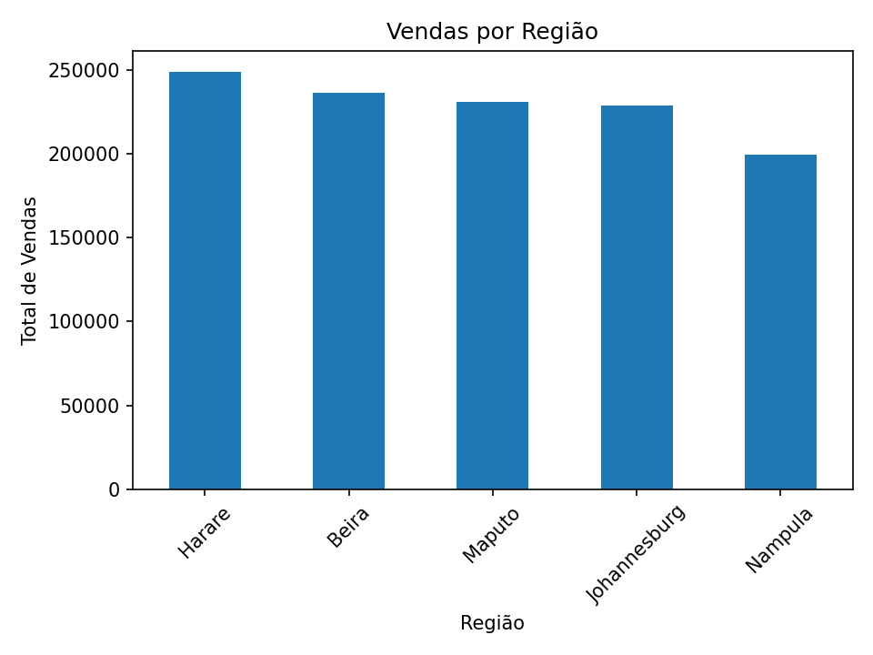
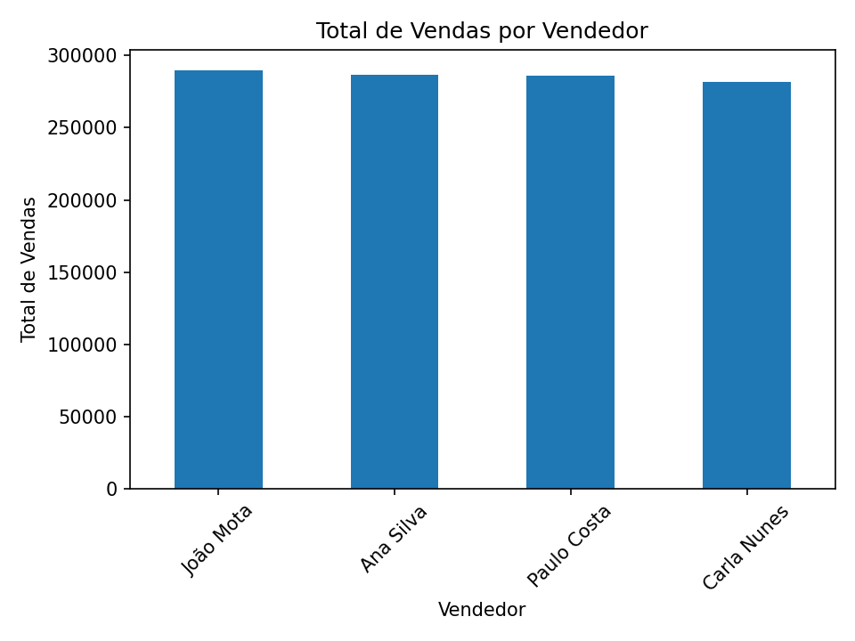
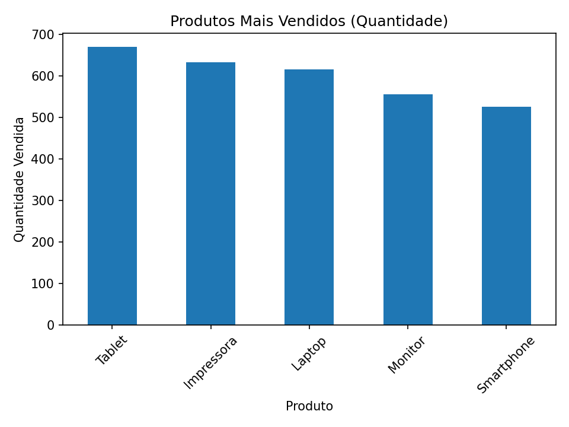

# 📊 Projecto 01: Análise Exploratória de Dados de Vendas

> *Projeto de Ciência de Dados | Python, Pandas, Matplotlib*

Este repositório contém a **análise exploratória completa (EDA)** de um conjunto de dados fictícios de vendas, com o objetivo de compreender o comportamento comercial, identificar padrões, tendências e insights acionáveis e úteis para apoiar decisões estratégicas de negócio. Os dados simulam operações de uma empresa distribuidora localizada em Moçambique e nos países vizinhos.

---

## 🎯 Objetivos do Projecto

- Realizar a Análise Exploratória de Dados (EDA) usando Python e Jupyter.
- Compreender a distribuição das vendas por produto, região, tempo e canal de pagamento.
- Identificar produtos mais vendidos e o desempenho de vendedores.
- Detectar possíveis outliers e verificar correlações entre variáveis.
- Gerar visualizações informativas e guardar os gráficos para uso posterior.
- Aplicar boas práticas de limpeza, análise e visualização de dados com Python.

---

## 🛠 Tecnologias Utilizadas

| Ferramenta | Uso |
|----------|-----|
| **Python** | Linguagem principal |
| **Pandas** | Manipulação e análise de dados |
| **Matplotlib** | Visualização de dados |
| **Jupyter Notebook** | Ambiente de desenvolvimento |
| **CSV** | Formato do dataset |

---

## 📁 Dataset

- **Nome:** `sales_data.csv`
- **Fonte:** Dados fictícios gerados para fins educativos
- **Registos:** 1.000 linhas
- **Colunas:** 9 (OrderID, Date, Region, Product, Quantity, UnitPrice, TotalSales, SalesRep, PaymentMethod)
- **Período:** Janeiro a Dezembro de 2024

📌 *O dataset foi gerado programaticamente para simular um cenário realista de vendas na região da África Austral.*

---

## 🧠 Metodologia

A análise foi realizada em Python com foco nas seguintes etapas:

1. **Carregamento e inspeção dos dados**
   - Verificação de tipos de dados
   - Conversão de datas
   - Detecção de valores nulos
2. **Criação de variáveis auxiliares**
   - Extração de mês e ano a partir da coluna de data
3. **Visualizações com `matplotlib`**
   - Barras, linhas, pizza e boxplots
4. **Cálculo de estatísticas e correlações**
   - Correlação entre `Quantidade`, `Preço Unitário` e `Total de Vendas`
   - Análise de consistência de cálculos
5. **Extração de insights** com base nos resultados

---

## 📈 Principais Insights

- 💻 **Produto com maior faturação:** Laptop
- 🌍 **Região com mais vendas:** Harare
- 📅 **Mês com maior volume de vendas:** Setembro (9)
- 🧑‍💼 **Melhor vendedor:** João Mota
- 💳 **Método de pagamento mais usado:** Dinheiro
- 📉 **Correlação forte:** entre `UnitPrice` e `TotalSales` (0.75)
- ⚠️ **Outliers detectados:** em todas variáveis numéricas com boxplots

> Estes insights podem orientar decisões como alocação de estoque, campanhas promocionais e incentivos a vendedores.

---

## 🖼 Exemplos de Visualizações

| Gráfico | Descrição |
|-------|-----------|
|  | Distribuição do vendas por região |
|  | Distribuição do vendas por produto |
|  | Distribuição do vendas por vendedor |
|  | Distribuição do produtos mais vendidos  |

|  | Evolução das vendas ao longo do tempo |

> *(Os gráficos estão disponíveis na pasta [`graficos/`](./graficos), em formato .png de alta qualidade)*

---

## 📦 Como Executar o Projeto

### Pré-requisitos
- Python 3.8 ou superior
- Jupyter Notebook (ou VS Code/Google Colab)

## 📌 Autor

**Moisés Mucelo**  
📧 [moises.mucelo@gmail.com] 

## 📄 Licença
Este projeto está licenciado sob a [MIT License](LICENSE).

